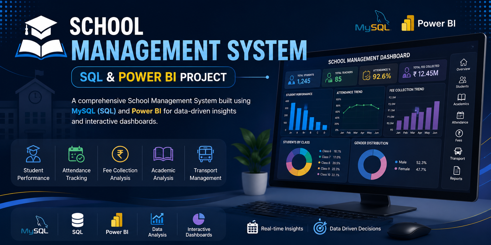

  

# 🎓 School Management System Analytics Dashboard

A complete Data Analytics project using **MySQL**, **SQL**, and **Power BI**.

## 📌 Project Overview

This project demonstrates how to build a complete **School Management Analytics Dashboard** using **MySQL**, **SQL**, and **Power BI**. The database stores information about students, teachers, attendance, fees, academics, and transportation. Power BI transforms this data into interactive dashboards for monitoring school performance and supporting data-driven decisions.

### 🚀 Technologies Used

- MySQL
- SQL
- Power BI

### 📂 Contents

- Dashboard Screenshots
- Executive Summary
- Attendance Dashboard
- Student Performance Dashboard
- Academic Performance Dashboard
- Fee Analysis Dashboard
- Transport Dashboard
- Teacher Dashboard
