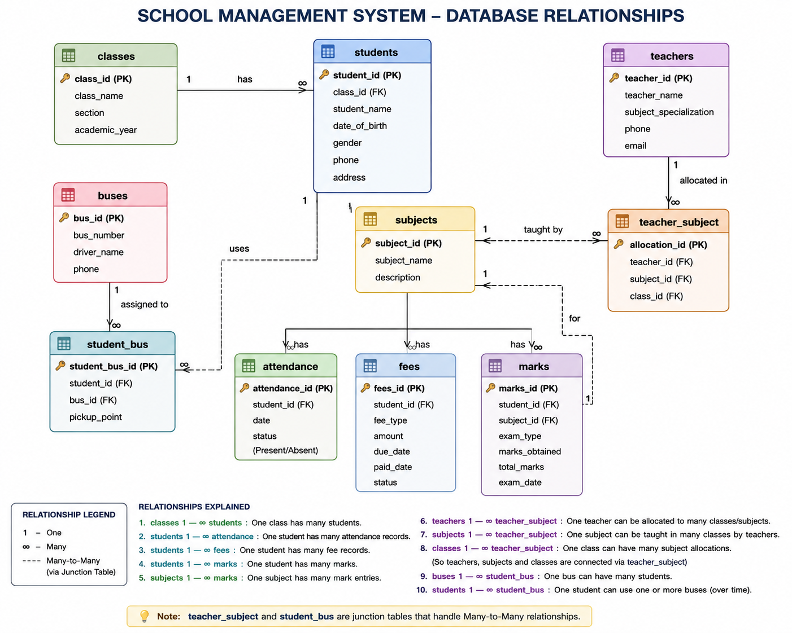
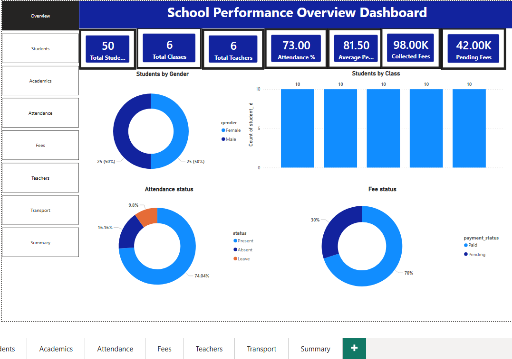
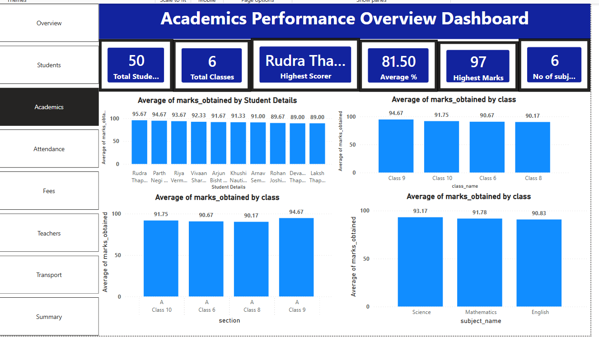
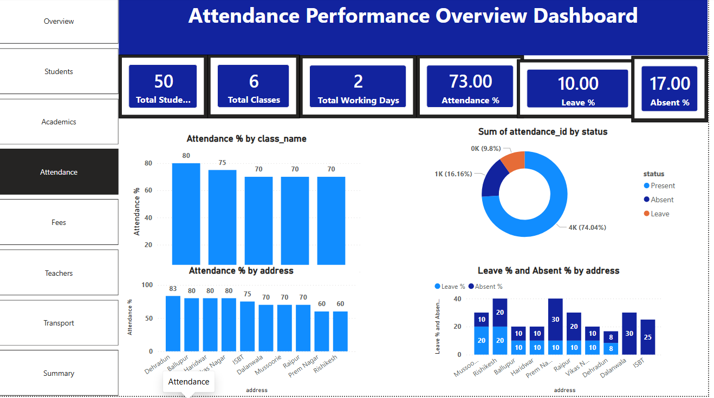
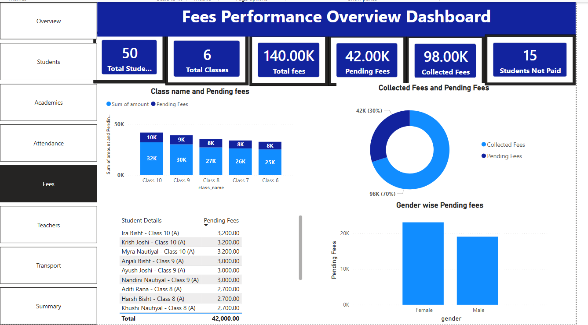
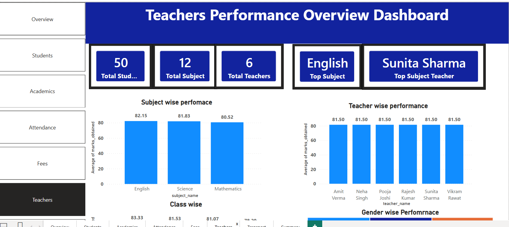
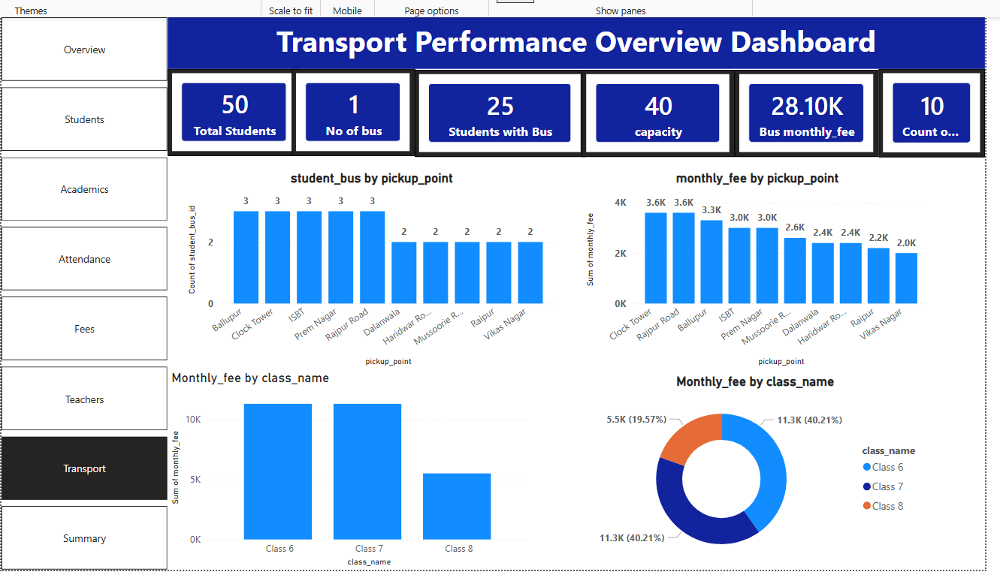

# School Management System Analytics Dashboard

## Overview

This project demonstrates a complete School Management System built using MySQL and Power BI.

The system manages:

* Students
* Teachers
* Classes
* Attendance
* Fees
* Academic Performance
* Transportation

The project combines relational database design with interactive business intelligence dashboards to generate actionable insights for school administration.

---

## Technologies Used

* MySQL
* SQL
* Power BI
* DAX
* Power Query
* Relational Database Design

---

## ER Diagram

---

## Features

### Student Management

* Student Records
* Gender Analysis
* Class-wise Distribution

### Academic Performance

* Highest Scorer Analysis
* Subject-wise Performance
* Class-wise Performance
* Average Marks Tracking

### Attendance Management

* Present/Absent Analysis
* Attendance Percentage
* Leave Monitoring

### Fee Management

* Fee Collection Tracking
* Pending Fee Analysis
* Student Fee Status

### Teacher Management

* Subject Allocation
* Teacher Performance Monitoring
* Top Performing Teacher

### Transport Management

* Bus Allocation
* Pickup Point Analysis
* Transport Fee Analysis

---

## Dashboard Screenshots

### Overview Dashboard

### Student Dashboard

### Academics Dashboard

### Attendance Dashboard

### Fees Dashboard

### Teachers Dashboard

### Transport Dashboard

### Executive Summary Dashboard

---

## Key Business Metrics

| KPI                    | Value    |
| ---------------------- | -------- |
| Total Students         | 50       |
| Total Teachers         | 6        |
| Total Classes          | 6        |
| Attendance Rate        | 73%      |
| Average Academic Score | 81.5%    |
| Total Fees             | ₹140,000 |
| Collected Fees         | ₹98,000  |
| Pending Fees           | ₹42,000  |

---

## SQL Concepts Used

* Primary Keys
* Foreign Keys
* INNER JOIN
* Aggregate Functions
* GROUP BY
* ORDER BY
* CASE Statements
* Analytical Queries

---

## Database Tables

1. Classes
2. Students
3. Teachers
4. Subjects
5. Teacher_Subject
6. Buses
7. Student_Bus
8. Attendance
9. Fees
10. Marks

---

## Power BI Features

* Interactive Dashboards
* KPI Cards
* Drill-down Analysis
* DAX Measures
* Cross Filtering
* Executive Summary Dashboard

---

## Repository Structure

School-Management-System-SQL-PowerBI

├── Images

├── PowerBI

├── SQL

├── README.md

├── analysis_queries.sql

├── database_schema.sql

├── insert_data.sql

└── school_management_er_diagram.png

---

## Future Enhancements

* Python + SQL Analytics
* Streamlit Application
* Stored Procedures
* Triggers
* Predictive Analytics

---

## Author

**Yogesh Pandey**

Founder – Vista Academy Dehradun

Skills:

* SQL
* Power BI
* Python
* Data Analytics
* Machine Learning
